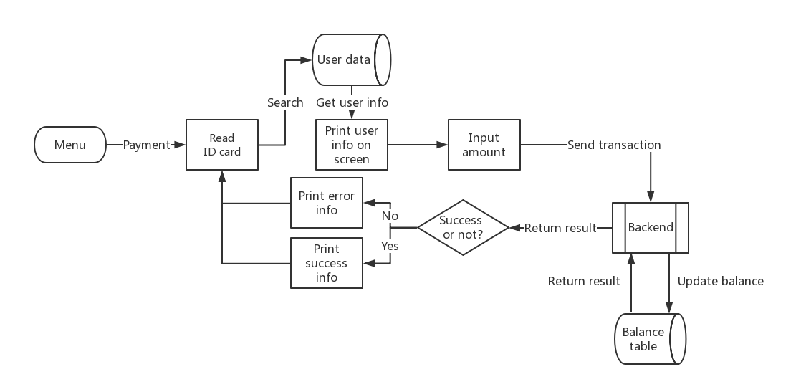
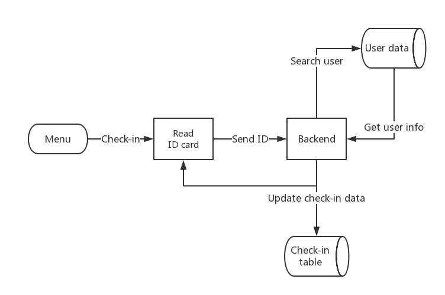

# ID card system based on Arduino singlechip terminal

Architecture: 

Flow chart: 
1. Payment

2. School Bus check-in

Terminal: 
* RFID card reader built on Arduino singlechip platform.
* remote control based on IRremote module
* LCD display
* Buzzer

Backend: 
* MySQL Database which can store personal information, balance information, etc.
* Serial Communication between terminal and database.

Notice: 
* settings.py should be modified to connect to MySQL database.
